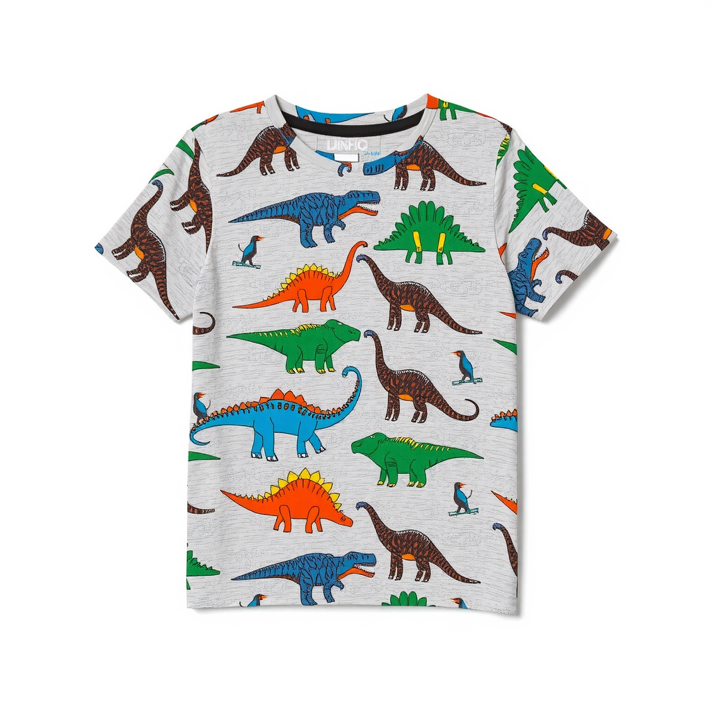
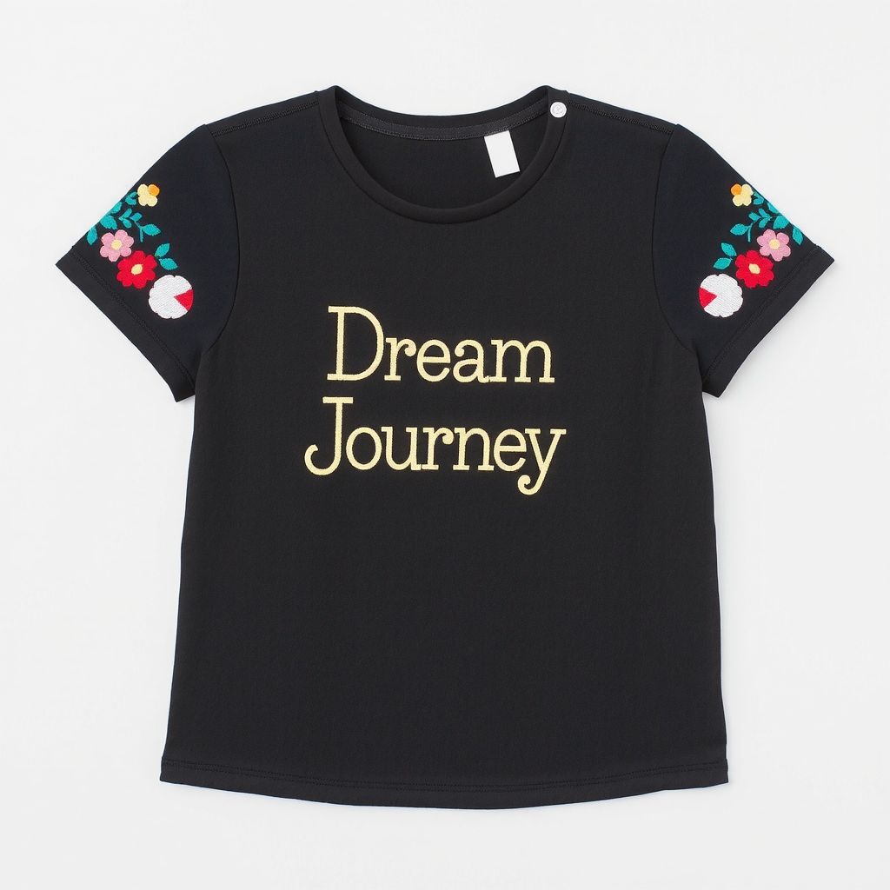
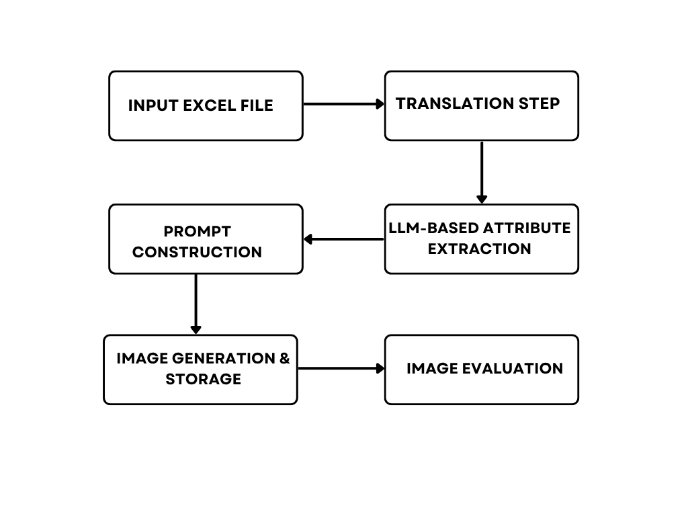
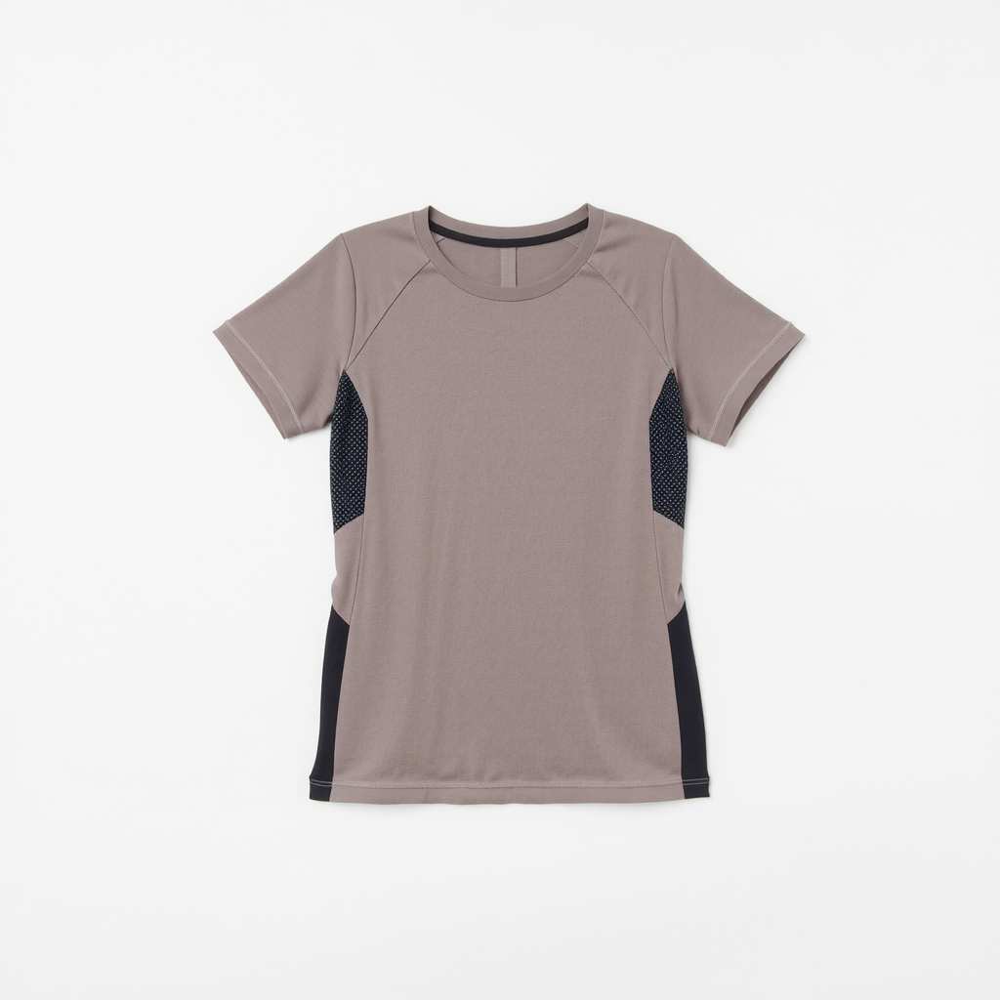
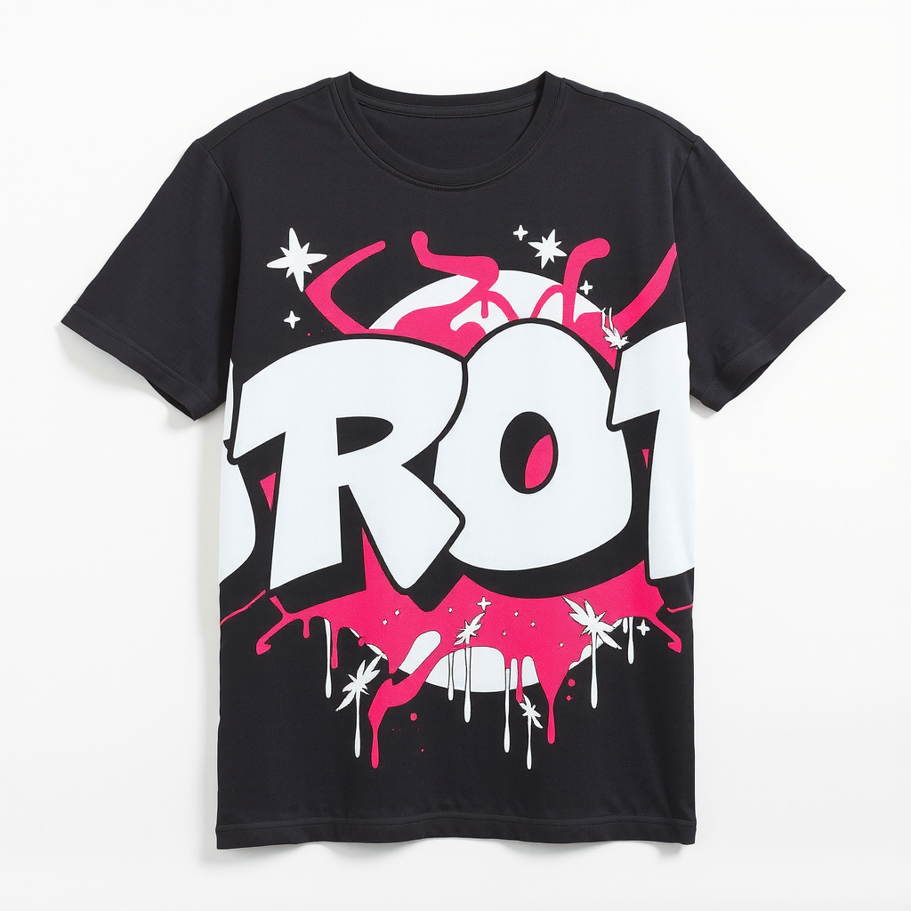

<h1 align="center">Fashion Article Image Generation</h1>

<p align="center">
  A four-model pipeline that turns German product descriptions into catalog-ready fashion images — translate, extract attributes, generate with a fashion-tuned diffusion model, and score the result. Developed with NKD, a German retailer, to cut catalog photography out of the loop.
</p>

<p align="center">
  
  
  
  
  
</p>

<p align="center">
  <a href="Article_image_generation.pdf">Report (PDF)</a> ·
  <a href="#the-pipeline">Pipeline</a> ·
  <a href="#quickstart">Quickstart</a> ·
  <a href="#results">Results</a> ·
  <a href="#citation">Cite</a>
</p>

<p align="center">
  
  
</p>
<p align="center"><em>Both images generated end-to-end from a German product description — no photography, no mannequin.</em></p>

## Overview

Fashion e-commerce runs on product photos, and shooting them is slow and expensive: studio, photographer, physical samples, post-processing, repeat for every article. This pipeline replaces that first pass with a text-to-image workflow. Feed it the German product copy a retailer already writes, and it returns a clean, front-view, white-background product image ready for a catalog draft.

The work was done with NKD (German fashion retail), using their product descriptions, and is written up in the accompanying [report](Article_image_generation.pdf). The intent is a first-pass generator that removes most of the manual shooting, not a zero-human system — a share of outputs still need regeneration or a human check (see [Results](#results)).

## The pipeline

Four models run in sequence, each handing off to the next:

1. **Translate** — `Helsinki-NLP/opus-mt-de-en` (MarianMT) converts the German description to English so the downstream English-trained models can use it.
2. **Extract attributes** — `microsoft/phi-3-mini-4k-instruct` pulls structured JSON from the free text (product type, visual features, colour, material, design), with a regex fallback if the model returns malformed JSON.
3. **Generate** — `black-forest-labs/FLUX.1-schnell` with the `aihpi/flux-fashion-lora` adapter renders the image from a constructed studio-photography prompt.
4. **Score** — `openai/clip-vit-large-patch14` measures image-text alignment (CLIP score) as an automated sanity check, saved alongside each image.

<p align="center">
  
</p>

## Quickstart

```bash
git clone https://github.com/thelostbong/Fashion-article-image-generation.git
cd Fashion-article-image-generation

# PyTorch matched to your CUDA version first, e.g. CUDA 11.8:
pip install torch torchvision --index-url https://download.pytorch.org/whl/cu118
pip install -r requirements.txt

huggingface-cli login          # needed to pull the models below
python Article_img_generation.py
```

The script reads the German descriptions in `Dataset/`, runs the four stages, and writes one `.png` plus a `.json` (prompts + CLIP score) per article.

> [!IMPORTANT]
> This needs a CUDA GPU with **≥12 GB VRAM** (RTX 3060 / A4000 or better) and a **Hugging Face token** — FLUX.1-schnell, Phi-3 Mini, and CLIP are all gated or large downloads (~50 GB of cache). It will not run on CPU in any reasonable time.

> [!NOTE]
> Generation is seeded (`torch.manual_seed(42)` across the stochastic stages), so a given description reproduces the same image — useful for A/B testing prompt changes.

## Results

The generated set was reviewed by multiple independent evaluators against a custom 0–10 deductive rubric covering nine visual and semantic aspects (product type, colour, design elements, prompt alignment, realism, and so on). The headline figures from that review, per the [report](Article_image_generation.pdf):

| Metric | Value | How measured |
|---|---|---|
| First-attempt success rate | >87.6% | Human review, custom 0–10 rubric |
| Attribute coverage | 94% | Share of description keywords retained in the final prompt |
| Category accuracy | 89% | Output matched the garment type in the description |
| Colour fidelity | 92% | Specified colours matched (minor hue deviations allowed) |
| Positional accuracy | 95% | Front prints / patterns placed correctly |
| Regeneration rate | 4.7% | Failures needing a re-run (e.g. colour bleeding 1.8%) |

Each image also carries an automated CLIP score (`clip-vit-large-patch14`) stored in its JSON — the committed samples land in the ~26–28 range. CLIP is used as a cheap alignment signal, not as the pass/fail gate; the human rubric above is the actual quality bar.

> [!NOTE]
> The rubric and per-aspect breakdown live in the report. The dataset is ~223 German descriptions across three spreadsheets in `Dataset/`.

### More samples

<p align="center">
  
  
</p>

Left: women's functional tee with contrast panel (from *"Damen-Funktions-T-Shirt mit Kontrasteinsatz"*). Right: men's graffiti-print tee (from *"Herren-T-Shirt mit Graffiti-Druck"*). Both are direct outputs, unretouched.

## Why FLUX.1-schnell

Several diffusion models were tried during development before settling on FLUX.1-schnell. The trade-off log:

| Model | Verdict |
|---|---|
| Stable Diffusion 1.5 / 2.1 | Fast but weak prompt adherence; SD 2.1 added unwanted objects |
| SD 1.5 + LoRA | Better, but stylized rather than photoreal |
| FLUX.1-dev | Excellent quality and adherence, but ~20 GB VRAM |
| **FLUX.1-schnell** | Excellent quality and adherence at lower VRAM and faster inference — **chosen** |

This is a qualitative development log, not a benchmarked comparison; treat it as the reasoning behind the choice.

## Repository structure

```
.
├── Article_img_generation.py        # the four-model pipeline
├── Article_image_generation.pdf     # project report (methodology + evaluation)
├── Execution Flow.txt               # architecture / flow notes
├── requirements.txt                 # Python dependencies
├── Dataset/                         # ~223 German product descriptions (.xlsx)
└── sample_outputs/                  # example generations (.png) + metadata (.json)
    ├── Flowchart_NKD.png            # pipeline diagram
    └── <id>.png / <id>.json         # image + prompts + CLIP score
```

## Roadmap

- **Multiple views** — front/back/side/detail via ControlNet conditioning, instead of a single front view.
- **Fashion-tuned LLM** — LoRA-fine-tune Phi-3 Mini on labeled fashion descriptions to push attribute coverage past 94% and handle specialist terms.
- **Interactive UI** — a Gradio/Streamlit front-end so non-technical users can edit the extracted attributes and regenerate.

## Citation

```bibtex
@techreport{mohammed2025fashiongen,
  title  = {Article Image Generation for NKD},
  author = {Mohammed, Nayeemuddin},
  year   = {2025},
  institution = {Deggendorf Institute of Technology},
  note   = {https://github.com/thelostbong/Fashion-article-image-generation}
}
```

## License · Acknowledgements · Contact

MIT License — see [LICENSE](LICENSE).

Done with NKD (German fashion retail) — thanks to Dr. Johannes Schöck and Florian K.T. Scheibner for the dataset and collaboration, and to Prof. Sunil P. Survaiya (THD) for supervision. Models from Hugging Face, Black Forest Labs (FLUX.1), Microsoft (Phi-3 Mini), OpenAI (CLIP), and Helsinki-NLP.

**Nayeemuddin Mohammed** — M.Sc. Applied AI for Digital Production Management, THD
[GitHub](https://github.com/thelostbong) · [LinkedIn](https://linkedin.com/in/nayeemuddin-mohammed-03/) · nayeemuddin.mohammed@th-deg.de
